# bastion-tunnel-app-runner

以下の記事のApp Runner版です。→[ECS FargateでSSMセッションマネージャーのリモートホストのポートフォワード環境を構築する](https://go-to-k.hatenablog.com/entry/ecs-fargate-ssm-remote-port-forward)

## 【注意】

### App Runnerでシグナルキャッチできない？

App Runner上で走るスクリプト[run.sh](./scripts/deploy_scripts/run.sh)で、trapによるDeregister処理をしているが、App Runner変更デプロイ時、SSMから削除されなかった。

```sh
cleanup() {
	# コンテナ終了時、マネージドインスタンス登録を解除
	echo "Deregister a managed instance..."
	aws ssm deregister-managed-instance --instance-id "$(cat "${REGISTRATION_FILE}" | jq -r .ManagedInstanceID)" || true
	exit 0
}

# 省略...

trap "cleanup" EXIT ERR
```

## 【概要】

AWSのサブネット(プライベート含む)内にあるリソースに、**リモートホストへのポートフォワード**を通して、ローカルPC(Mac)から直接アクセス(トンネリング)するためのツール。

例えば、ローカルPCのターミナルから、プライベートサブネット内の**EC2・RDS・AuroraなどのMySQLやPostgreSQL**に直接アクセスしたりできるようになります。

## 【アーキテクチャ】



## 【前提(ローカルPC環境)】

**Macを想定しています。**

以下のインストールをしてください。

### AWS CLI (v2)

- [公式ドキュメント](https://docs.aws.amazon.com/ja_jp/cli/latest/userguide/getting-started-install.html)

```sh
curl "https://awscli.amazonaws.com/AWSCLIV2.pkg" -o "AWSCLIV2.pkg"

sudo installer -pkg ./AWSCLIV2.pkg -target /
```

### Session Manager プラグイン

- [公式ドキュメント](https://docs.aws.amazon.com/ja_jp/systems-manager/latest/userguide/session-manager-working-with-install-plugin.html#install-plugin-macos)

```sh
curl "https://s3.amazonaws.com/session-manager-downloads/plugin/latest/mac/sessionmanager-bundle.zip" -o "sessionmanager-bundle.zip"

unzip sessionmanager-bundle.zip

sudo ./sessionmanager-bundle/install -i /usr/local/sessionmanagerplugin -b /usr/local/bin/session-manager-plugin
```

### jq

```sh
brew install jq
```

## 【デプロイ】

### VPC、サブネット情報を埋める

- [config.ts](./lib/config.ts)の`account`、`VpcID`、`SubnetID1`、`SubnetID2`にVPC Connectorに指定する自環境のVPC情報を記入する
  ```ts
  export const stackInput: StackInput = {
    stackEnv: {
      // FIXME
      account: "123456789012", // Your AWS Account ID
      region: "ap-northeast-1",
    },
    appName: "Bastion",
    vpcConnectorProps: {
      // FIXME
      vpcID: "vpc-1234abcd1234abcd00", // Your VPC ID
      subnetID1: "subnet-1234abcd1234abcd01", // Your Subnet ID
      subnetID2: "subnet-1234abcd1234abcd02", // Your Subnet ID
    },
  ```

### デプロイする

```sh
cdk deploy
```

## 【tunnelコマンドの使い方】

### ■初期化(初回のみ)

本リポジトリをクローンしてリポジトリの直下に移動し、以下コマンドを叩くことで、本ツールスクリプトのパスが通ります。

(ツールを叩く際にパスを指定せず、コマンドとして使用できるようになります。)

```sh
cd bastion-tunnel-app-runner
sh scripts/tunnel_scripts/init.sh

# どのパスでも以下コマンドが叩けるようになります
tunnel
```

### ■スクリプト内で接続先情報を埋めておく(任意)

- [tunnel.sh](./scripts/tunnel_scripts/tunnel.sh)で接続先のRDSなどのホストやポートを記入しておくと、オプションなしでも決めたターゲットにアクセスできて便利です。（コマンド実行時のオプションでも指定可能です。）
  - `LOCAL_DB_PORT="13306"`
  - `TARGET_DB_PORT="3306"`
  - `TARGET_HOST="abcde.cluster-1234567890.ap-northeast-1.rds.amazonaws.com"`

### ■トンネルコマンド(毎回)

- コマンド
  - `tunnel`
- オプション
  - -p : AWSプロファイル
    - デフォルト : 空
  - -l : ローカルポート
    - デフォルト : 13306
  - -t : ターゲットポート(リモートポート)
    - デフォルト : 3306
  - -h : ターゲットホスト
    - デフォルト : abcde.cluster-1234567890.ap-northeast-1.rds.amazonaws.com
  - -r : App Runnerを構築したAWSリージョン
    - デフォルト : ap-northeast-1

```sh
## デフォルト値
### ローカルポート:13306
### ターゲットポート:3306

# デフォルトのAWSクレデンシャル(プロファイル)を使う場合
tunnel

# AWSプロファイルを指定する場合
tunnel -p profile

# ローカルポートを13306から変える場合
tunnel -l 15432

# ターゲットポートを3306から変える場合(PostgreSQLなど)
tunnel -t 5432

# ターゲットのホストを指定する場合
tunnel -h fghij.cluster-1234567890.ap-northeast-1.rds.amazonaws.com

# リージョンを東京リージョン以外でデプロイした場合
tunnel -r us-east-1

# オプションは複数指定可能
tunnel -l 15432 -t 5432 -p profile


# 数秒待つとリモートホストへのポートフォワードがされ、DBなどへの接続が可能になります
mysql -u my_user -p -h 127.0.0.1 -P13306

```

### ■自動切断

`tunnel`コマンド使用後、30分経過したら自動で切断されます。

都度`tunnel`コマンドを投げ直して下さい。

タイムアウト情報は[sessionManagerRunShell.json](./deploy_scripts/sessionManagerRunShell.json)ファイルで変更できます。
- idleSessionTimeout
- maxSessionDuration

### ■接続ログ

`./tunnel_logs`直下にログが溜まります。

また、tunnelコマンドを叩いた際に、1日以上前に作られたログファイルは自動で削除されます。

- 例
  - 2023_0607_171808.log
  - 2023_0607_174822.log

  ```
  
  Starting session with SessionId: goto-06dc86f29feabc116
  Port 13306 opened for sessionId goto-06dc86f29feabc116.
  Waiting for connections...
  
  Connection accepted for session [goto-06dc86f29feabc116]
  ```
